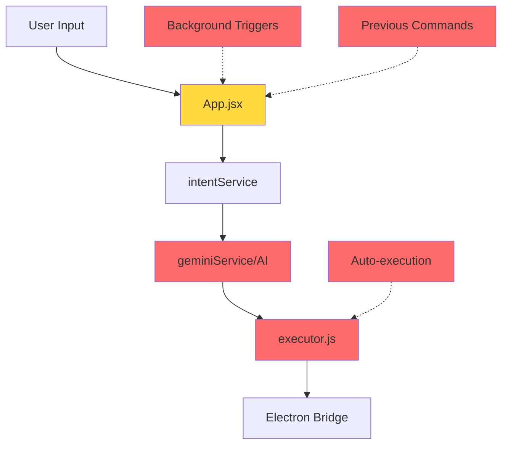
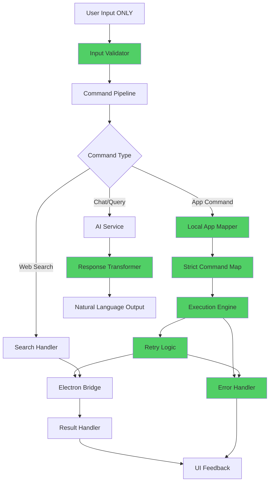
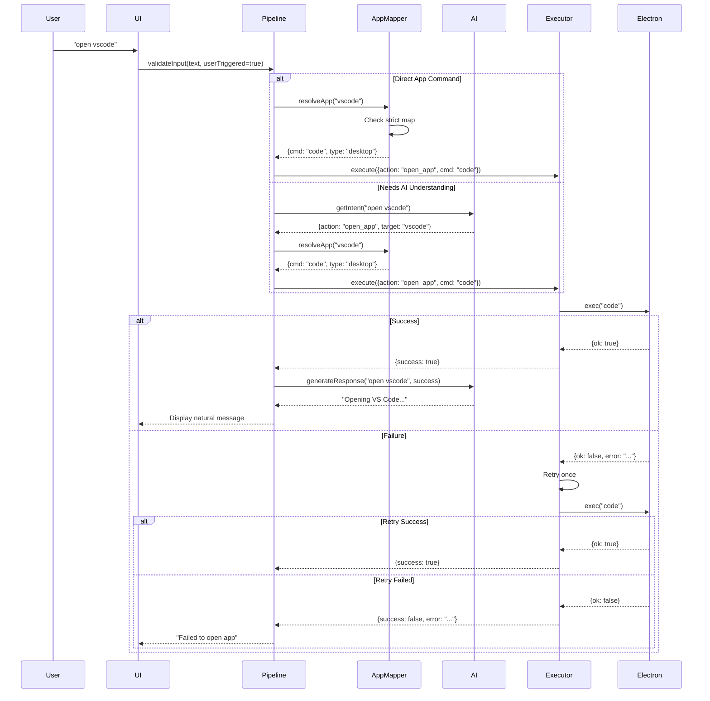

# Design Document: Execution Reliability & UX Improvements

## Overview

This design addresses critical reliability and user experience issues in the Cognitive OS desktop assistant. The current architecture suffers from unreliable app execution, robotic AI responses, UI positioning bugs, and unintended automatic execution. This comprehensive redesign establishes a strict command pipeline with local execution control, natural language response transformation, improved floating UI, and complete elimination of automatic triggers.

The solution separates concerns clearly: AI provides intent understanding and natural responses, while local execution handles all system interactions with proper error handling and retry logic. The UI becomes a stable, draggable floating assistant that appears only on user demand.

## Architecture

### Current Architecture Issues



**Problems:**
- AI response returned directly to UI (raw JSON visible)
- Execution reliability depends on AI response quality
- Background triggers cause unwanted execution
- No strict app command mapping
- Floating UI has transparency and positioning bugs
- No proper error handling or retry logic

### Proposed Architecture



**Improvements:**
- Strict input validation (user-triggered only)
- Local app mapping with fallback
- AI used for understanding, not execution control
- Response transformation layer
- Comprehensive error handling
- No background triggers

### Command Flow Sequence



## Components and Interfaces

### Component 1: Input Validator

**Purpose**: Ensures all commands originate from explicit user actions

**Interface**:
```typescript
interface InputValidator {
  validate(input: string, options: InputOptions): ValidationResult
  isUserTriggered(options: InputOptions): boolean
  sanitize(input: string): string
}

interface InputOptions {
  userTriggered: boolean
  source: 'voice' | 'text' | 'chat'
  timestamp: number
}

interface ValidationResult {
  valid: boolean
  sanitized: string
  error?: string
}
```

**Responsibilities**:
- Verify `userTriggered` flag is true
- Reject empty or whitespace-only input
- Sanitize input (trim, normalize)
- Prevent duplicate submissions within debounce window
- Block background/automatic triggers

**Validation Rules**:
- `userTriggered` must be `true`
- Input must be non-empty after trimming
- Must not match last command within 500ms
- Source must be valid ('voice', 'text', or 'chat')

### Component 2: Command Pipeline

**Purpose**: Central orchestrator for all command processing

**Interface**:
```typescript
interface CommandPipeline {
  process(input: string, options: InputOptions): Promise<PipelineResult>
  classify(input: string): CommandType
  route(type: CommandType, input: string): Promise<ExecutionPlan>
}

interface CommandType {
  category: 'app' | 'web' | 'chat' | 'system'
  confidence: number
  requiresAI: boolean
}

interface ExecutionPlan {
  steps: ExecutionStep[]
  naturalResponse: string
  fallbackMessage: string
}

interface ExecutionStep {
  action: 'open_app' | 'search_web' | 'ui_action' | 'tab_control'
  target: string
  cmd?: string
  params?: Record<string, any>
}

interface PipelineResult {
  success: boolean
  message: string
  executedSteps: number
  error?: string
}
```

**Responsibilities**:
- Classify command type (app, web, chat, system)
- Route to appropriate handler (local mapper or AI)
- Coordinate execution flow
- Transform AI responses to natural language
- Handle errors and provide user feedback
- Maintain execution state

### Component 3: Local App Mapper

**Purpose**: Strict, reliable mapping of app names to system commands

**Interface**:
```typescript
interface LocalAppMapper {
  resolve(appName: string): AppCommand | null
  register(appName: string, command: AppCommand): void
  scan(): Promise<void>
  getAvailable(): string[]
}

interface AppCommand {
  name: string
  cmd: string
  type: 'system' | 'desktop' | 'url' | 'scanned'
  verified: boolean
}
```

**Strict Command Map**:
```typescript
const SYSTEM_APPS: Record<string, AppCommand> = {
  'settings': { name: 'settings', cmd: 'start ms-settings:', type: 'system', verified: true },
  'control panel': { name: 'control panel', cmd: 'control', type: 'system', verified: true }
}

const DESKTOP_APPS: Record<string, AppCommand> = {
  'vscode': { name: 'vscode', cmd: 'code', type: 'desktop', verified: true },
  'code': { name: 'code', cmd: 'code', type: 'desktop', verified: true },
  'chrome': { name: 'chrome', cmd: 'start chrome', type: 'desktop', verified: true },
  'edge': { name: 'edge', cmd: 'start msedge', type: 'desktop', verified: true },
  'notepad': { name: 'notepad', cmd: 'notepad', type: 'desktop', verified: true },
  'calculator': { name: 'calculator', cmd: 'calc', type: 'desktop', verified: true },
  'calc': { name: 'calc', cmd: 'calc', type: 'desktop', verified: true },
  'explorer': { name: 'explorer', cmd: 'explorer', type: 'desktop', verified: true }
}

const URL_MAP: Record<string, AppCommand> = {
  'youtube': { name: 'youtube', cmd: 'start https://youtube.com', type: 'url', verified: true },
  'google': { name: 'google', cmd: 'start https://google.com', type: 'url', verified: true },
  'gmail': { name: 'gmail', cmd: 'start https://mail.google.com', type: 'url', verified: true },
  'github': { name: 'github', cmd: 'start https://github.com', type: 'url', verified: true },
  'whatsapp': { name: 'whatsapp', cmd: 'start https://web.whatsapp.com', type: 'url', verified: true }
}
```

**Responsibilities**:
- Maintain strict app-to-command mappings
- Resolve app names to executable commands
- Scan system for additional apps (cached)
- Verify command availability
- Return null for unknown apps (no guessing)

**Resolution Priority**:
1. System apps (settings, control panel)
2. Desktop apps (vscode, chrome, etc.)
3. URL mappings (youtube, google, etc.)
4. Scanned apps (cached from system scan)
5. Return null if not found

### Component 4: Execution Engine

**Purpose**: Reliable command execution with retry logic and error handling

**Interface**:
```typescript
interface ExecutionEngine {
  execute(step: ExecutionStep): Promise<ExecutionResult>
  retry(step: ExecutionStep, maxAttempts: number): Promise<ExecutionResult>
  validate(step: ExecutionStep): boolean
}

interface ExecutionResult {
  success: boolean
  message: string
  error?: string
  retried: boolean
  attempts: number
}
```

**Responsibilities**:
- Execute validated commands via Electron bridge
- Implement retry logic (1 retry on failure)
- Log all execution attempts
- Provide clear error messages
- Never fake success
- Handle timeouts

**Execution Flow**:
```typescript
async function execute(step: ExecutionStep): Promise<ExecutionResult> {
  // Validate step
  if (!validate(step)) {
    return { success: false, message: 'Invalid command', error: 'Validation failed', retried: false, attempts: 0 }
  }
  
  // First attempt
  let result = await executeOnce(step)
  
  if (result.success) {
    return { ...result, retried: false, attempts: 1 }
  }
  
  // Retry once
  await wait(500)
  result = await executeOnce(step)
  
  if (result.success) {
    return { ...result, retried: true, attempts: 2 }
  }
  
  // Both failed
  return {
    success: false,
    message: 'Failed to open app',
    error: result.error,
    retried: true,
    attempts: 2
  }
}
```

### Component 5: Response Transformer

**Purpose**: Convert AI JSON responses to natural, human-like messages

**Interface**:
```typescript
interface ResponseTransformer {
  transform(aiResponse: AIResponse, context: ExecutionContext): string
  generateNaturalMessage(action: string, target: string, success: boolean): string
  getTone(): 'natural' | 'assistant' | 'concise'
}

interface AIResponse {
  kind: 'command' | 'chat'
  action?: string
  target?: string
  message?: string
}

interface ExecutionContext {
  action: string
  target: string
  success: boolean
  error?: string
}
```

**Transformation Rules**:
```typescript
const NATURAL_RESPONSES: Record<string, (target: string) => string> = {
  'open_app': (target) => `Opening ${target}...`,
  'search_web': (target) => `Searching for ${target}...`,
  'scroll': (target) => `Scrolling ${target}...`,
  'click': (target) => `Clicking ${target}...`,
  'type': (target) => `Typing...`
}

const ERROR_RESPONSES: Record<string, (target: string) => string> = {
  'open_app': (target) => `Failed to open ${target}`,
  'search_web': (target) => `Failed to search for ${target}`,
  'default': () => 'Something went wrong'
}
```

**Responsibilities**:
- Convert JSON to natural language
- Maintain assistant-like tone (not robotic)
- Keep messages short and clear
- Handle success and error cases
- Never expose raw JSON to UI

**Examples**:
- Input: `{"action":"open_app","target":"vscode"}` → Output: `"Opening VS Code..."`
- Input: `{"action":"search_web","target":"AI"}` → Output: `"Searching for AI..."`
- Input: Chat response → Output: Pass through as-is
- Error case → Output: `"Failed to open app"`

### Component 6: Floating Assistant UI

**Purpose**: Stable, draggable floating interface with proper positioning

**Interface**:
```typescript
interface FloatingAssistant {
  show(): void
  hide(): void
  toggle(): void
  setPosition(x: number, y: number): void
  isDragging(): boolean
}

interface UIConfig {
  defaultPosition: 'bottom-right' | 'bottom-left' | 'top-right' | 'top-left'
  maxWidth: number
  maxHeight: number
  zIndex: number
  backgroundColor: string
  opacity: number
}
```

**UI Specifications**:
- **Position**: Fixed bottom-right by default
- **Size**: Max width 300px, height auto (max 80vh)
- **Draggable**: Yes, with drag constraints
- **Background**: Solid (no transparency bugs)
- **Z-index**: 100 (high but not blocking)
- **Default State**: Hidden on startup
- **Toggle**: Keyboard shortcut or button

**Layout Structure**:
```
┌─────────────────────────────┐
│ Header                      │
│ [●] FRIDAY Interface    [×] │
├─────────────────────────────┤
│                             │
│ Message History             │
│ (scrollable)                │
│                             │
├─────────────────────────────┤
│ Input Controls              │
│ [Text Input]  [🎤]          │
└─────────────────────────────┘
```

**Responsibilities**:
- Render at fixed bottom-right position
- Allow dragging within screen bounds
- Maintain solid background (no transparency)
- Show/hide on toggle
- Display message history
- Provide mic and text input
- Handle close button

## Data Models

### Model 1: Command

```typescript
interface Command {
  id: string
  input: string
  type: CommandType
  timestamp: number
  userTriggered: boolean
  source: 'voice' | 'text' | 'chat'
  status: 'pending' | 'processing' | 'success' | 'failed'
}
```

**Validation Rules**:
- `id` must be unique
- `input` must be non-empty string
- `userTriggered` must be true
- `source` must be valid enum value
- `timestamp` must be valid Unix timestamp

### Model 2: ExecutionState

```typescript
interface ExecutionState {
  isExecuting: boolean
  currentCommand: Command | null
  queue: Command[]
  lastExecutedAt: number
  executionCount: number
}
```

**Validation Rules**:
- `isExecuting` prevents concurrent execution
- `currentCommand` is null when idle
- `queue` is cleared after each execution
- `lastExecutedAt` used for debouncing

### Model 3: AppRegistry

```typescript
interface AppRegistry {
  systemApps: Map<string, AppCommand>
  desktopApps: Map<string, AppCommand>
  urlMappings: Map<string, AppCommand>
  scannedApps: Map<string, AppCommand>
  lastScanAt: number
}
```

**Validation Rules**:
- All maps use lowercase keys
- Commands must have valid `cmd` property
- `type` must be valid enum value
- `verified` indicates command was tested
- Cache expires after 1 hour

### Model 4: UIState

```typescript
interface UIState {
  isVisible: boolean
  position: { x: number, y: number }
  isDragging: boolean
  messages: Message[]
  isProcessing: boolean
}

interface Message {
  id: string
  text: string
  role: 'user' | 'assistant' | 'system'
  timestamp: number
}
```

**Validation Rules**:
- `isVisible` controls display
- `position` constrained to screen bounds
- `messages` limited to last 50
- `role` must be valid enum value

## Correctness Properties

*A property is a characteristic or behavior that should hold true across all valid executions of a system—essentially, a formal statement about what the system should do. Properties serve as the bridge between human-readable specifications and machine-verifiable correctness guarantees.*

### Property 1: User-Triggered Execution Only

*For all* commands submitted to the system, execution SHALL occur only when the command has the userTriggered flag set to true.

**Validates: Requirements 1.1, 1.2, 1.4**

### Property 2: Input Validation Rejects Invalid Input

*For all* input strings that are empty or contain only whitespace, the Input_Validator SHALL reject them without processing.

**Validates: Requirements 2.1**

### Property 3: Duplicate Command Prevention

*For all* commands submitted within 500ms of the previous identical command, the Input_Validator SHALL reject the duplicate.

**Validates: Requirements 2.2**

### Property 4: Input Sanitization

*For all* valid input strings, the Input_Validator SHALL produce sanitized output with no leading or trailing whitespace.

**Validates: Requirements 2.3**

### Property 5: Strict App Mapping Determinism

*For all* known app names, the Local_App_Mapper SHALL resolve to the same AppCommand on every invocation.

**Validates: Requirements 3.1**

### Property 6: Unknown Apps Return Null

*For all* app names not in any registry, the Local_App_Mapper SHALL return null without guessing or generating commands.

**Validates: Requirements 3.2, 3.5**

### Property 7: Case-Insensitive App Resolution

*For all* known app names and any case variation of that name, the Local_App_Mapper SHALL resolve to the same AppCommand.

**Validates: Requirements 3.4**

### Property 8: Retry Attempt Limit

*For all* command executions, the Execution_Engine SHALL make at most 2 total execution attempts.

**Validates: Requirements 4.3**

### Property 9: Retry on Failure

*For all* command executions that fail on the first attempt, the Execution_Engine SHALL wait 500ms and retry once.

**Validates: Requirements 4.1**

### Property 10: Error Result on Double Failure

*For all* command executions that fail on both attempts, the Execution_Engine SHALL return an error result.

**Validates: Requirements 4.2**

### Property 11: Success Without Retry

*For all* command executions that succeed on the first attempt, the Execution_Engine SHALL return success with the retry flag set to false.

**Validates: Requirements 4.4**

### Property 12: Natural Language Transformation

*For all* AI responses received, the Response_Transformer SHALL convert them to natural language output without JSON syntax.

**Validates: Requirements 5.1, 5.2**

### Property 13: Success Message Format

*For all* successful app open operations, the Response_Transformer SHALL generate a message matching the pattern "Opening [app name]...".

**Validates: Requirements 5.3**

### Property 14: Command Classification

*For all* validated input, the Command_Pipeline SHALL classify the command type as one of: app, web, chat, or system.

**Validates: Requirements 6.1**

### Property 15: App Command Routing

*For all* commands classified as type 'app', the Command_Pipeline SHALL route to the Local_App_Mapper.

**Validates: Requirements 6.2**

### Property 16: UI Width Constraint

*For all* UI rendering states, the Floating_Assistant SHALL have a width not exceeding 300px.

**Validates: Requirements 7.3**

### Property 17: UI Height Constraint

*For all* UI rendering states, the Floating_Assistant SHALL have a height not exceeding 80vh.

**Validates: Requirements 7.4**

### Property 18: Drag Position Updates

*For all* drag operations on the Floating_Assistant, the system SHALL update the position in real-time.

**Validates: Requirements 8.1**

### Property 19: Drag Bounds Constraint

*For all* drag operations, the Floating_Assistant position SHALL remain within screen bounds.

**Validates: Requirements 8.2**

### Property 20: Position Persistence After Drag

*For all* completed drag operations, the Floating_Assistant SHALL maintain its position after dragging stops.

**Validates: Requirements 8.5**

### Property 21: Null Result Handling

*For all* null results returned by the Local_App_Mapper, the Command_Pipeline SHALL handle them without attempting execution.

**Validates: Requirements 9.1, 9.3**

### Property 22: AI Fallback on Failure

*For all* AI service errors or timeouts, the Command_Pipeline SHALL fall back to keyword-based matching.

**Validates: Requirements 11.1**

### Property 23: Local Commands Work Without AI

*For all* local app commands, the system SHALL execute them successfully even when AI is unavailable.

**Validates: Requirements 11.4**

### Property 24: Concurrent Command Queueing

*For all* commands submitted while another is executing, the Command_Pipeline SHALL add them to the queue.

**Validates: Requirements 12.1**

### Property 25: Sequential Queue Processing

*For all* queued commands, the Command_Pipeline SHALL process the next command after the current one completes.

**Validates: Requirements 12.3**

### Property 26: Error Boundary Catches Component Errors

*For all* React component errors, the error boundary SHALL catch them and prevent full application crash.

**Validates: Requirements 13.1, 13.5**

### Property 27: Scan Cache Expiration

*For all* app scans, the Local_App_Mapper SHALL cache results and expire them after 1 hour.

**Validates: Requirements 15.2, 25.4**

### Property 28: Directory Recursion Limit

*For all* system scans, the Local_App_Mapper SHALL limit directory recursion depth to 3 levels.

**Validates: Requirements 15.3**

### Property 29: Message History Limit

*For all* message additions, the system SHALL maintain at most 50 messages in history.

**Validates: Requirements 16.4, 17.2, 21.2**

### Property 30: Queue Cleared After Execution

*For all* command executions that complete, the Command_Pipeline SHALL clear the execution queue.

**Validates: Requirements 1.3, 17.3**

### Property 31: App Cache Size Limit

*For all* app additions to the cache, the Local_App_Mapper SHALL maintain at most 500 cached entries.

**Validates: Requirements 17.4**

### Property 32: Command Whitelist Enforcement

*For all* commands submitted for execution, the Local_App_Mapper SHALL only allow whitelisted commands.

**Validates: Requirements 18.2**

### Property 33: No Shell Interpolation

*For all* user input containing shell metacharacters, the Execution_Engine SHALL NOT perform shell interpolation.

**Validates: Requirements 18.3**

### Property 34: AI Response Action Validation

*For all* AI responses, the Command_Pipeline SHALL validate that the action type is in the allowed set.

**Validates: Requirements 19.1**

### Property 35: Command Verification Before Execution

*For all* app commands, the Local_App_Mapper SHALL verify them before execution.

**Validates: Requirements 19.2**

### Property 36: Local Validation of AI Commands

*For all* AI-generated commands, the system SHALL perform local validation before execution.

**Validates: Requirements 19.3**

### Property 37: Output Sanitization

*For all* output displayed to the user, the Response_Transformer SHALL sanitize it before display.

**Validates: Requirements 19.4**

### Property 38: Auto-Scroll on New Message

*For all* new messages added to the history, the system SHALL scroll to show the latest message.

**Validates: Requirements 21.3**

### Property 39: Message Role Display

*For all* messages displayed, the system SHALL show role indicators (user, assistant, or system).

**Validates: Requirements 21.4**

### Property 40: Message Timestamp Display

*For all* messages displayed, the system SHALL show timestamps.

**Validates: Requirements 21.5**

### Property 41: Enter Key Submission

*For all* Enter key presses in the text input field, the system SHALL submit the command.

**Validates: Requirements 22.3**

### Property 42: Microphone Button Activation

*For all* microphone button clicks, the system SHALL activate voice input.

**Validates: Requirements 22.4**

### Property 43: Input Clearing After Submission

*For all* successful command submissions, the system SHALL clear the text input field.

**Validates: Requirements 22.5**

### Property 44: Keyboard Shortcut Toggle

*For all* keyboard shortcut presses, the system SHALL toggle the Floating_Assistant visibility.

**Validates: Requirements 23.2**

### Property 45: Button Toggle

*For all* toggle button clicks, the system SHALL toggle the Floating_Assistant visibility.

**Validates: Requirements 23.3**

### Property 46: Close Button Hides UI

*For all* close button clicks, the Floating_Assistant SHALL hide.

**Validates: Requirements 23.5**

### Property 47: Execution Flag Set on Start

*For all* command execution starts, the Command_Pipeline SHALL set the isExecuting flag to true.

**Validates: Requirements 24.2**

### Property 48: Execution Flag Cleared on Completion

*For all* command execution completions, the Command_Pipeline SHALL set the isExecuting flag to false.

**Validates: Requirements 24.3**

### Property 49: Current Command Set During Execution

*For all* commands being executed, the Command_Pipeline SHALL maintain a currentCommand reference.

**Validates: Requirements 24.4**

### Property 50: Current Command Null When Idle

*For all* idle states, the Command_Pipeline SHALL set currentCommand to null.

**Validates: Requirements 24.5**

### Property 51: Lowercase Registry Keys

*For all* app registrations, the Local_App_Mapper SHALL store keys in lowercase.

**Validates: Requirements 25.2**

## Error Handling

### Error Scenario 1: App Not Found

**Condition**: User requests to open an app that doesn't exist in any registry

**Response**:
1. Local mapper returns null
2. Pipeline catches null result
3. Response transformer generates: "App not found"
4. UI displays error message
5. No execution attempted

**Recovery**: User can try different app name or check available apps

### Error Scenario 2: Execution Failure

**Condition**: Electron bridge fails to execute command

**Response**:
1. Executor receives `{ok: false, error: "..."}` from bridge
2. Wait 500ms
3. Retry command once
4. If retry fails, return error to pipeline
5. Response transformer generates: "Failed to open app"
6. UI displays error message

**Recovery**: User can retry manually or check system state

### Error Scenario 3: AI Service Unavailable

**Condition**: AI service (Gemini/Groq) returns error or times out

**Response**:
1. Pipeline catches AI error
2. Falls back to keyword-based command matching
3. If keyword match found, execute directly
4. If no match, display: "AI unavailable, try simple commands"
5. UI remains functional

**Recovery**: System continues with local command processing

### Error Scenario 4: Invalid Input

**Condition**: User submits empty or invalid input

**Response**:
1. Input validator rejects input
2. Return validation error
3. No processing or execution
4. UI shows no feedback (silent rejection)

**Recovery**: User submits valid input

### Error Scenario 5: Concurrent Execution Attempt

**Condition**: User submits command while another is executing

**Response**:
1. Pipeline checks `isExecuting` flag
2. Add command to queue
3. Display queue size indicator
4. Process queued command after current completes

**Recovery**: Automatic - queued command executes next

### Error Scenario 6: UI Crash

**Condition**: React component throws error

**Response**:
1. Error boundary catches error
2. Display fallback UI: "Something went wrong"
3. Provide "Reload" button
4. Log error for debugging
5. Prevent full app crash

**Recovery**: User reloads UI or restarts app

## Testing Strategy

### Unit Testing Approach

**Input Validator Tests**:
- Test rejection of non-user-triggered commands
- Test empty input rejection
- Test duplicate command detection
- Test input sanitization

**Local App Mapper Tests**:
- Test resolution of all predefined apps
- Test null return for unknown apps
- Test priority order (system → desktop → url → scanned)
- Test case-insensitive matching

**Execution Engine Tests**:
- Test successful execution
- Test retry logic on failure
- Test error message generation
- Test timeout handling

**Response Transformer Tests**:
- Test JSON to natural language conversion
- Test all action types
- Test error message generation
- Test tone consistency

**Coverage Goal**: 90% for core components

### Property-Based Testing Approach

**Property Test Library**: fast-check (JavaScript/TypeScript)

**Test Properties**:

1. **User-Triggered Invariant**:
```typescript
fc.assert(
  fc.property(fc.string(), fc.boolean(), (input, userTriggered) => {
    const result = validator.validate(input, { userTriggered, source: 'text', timestamp: Date.now() })
    return userTriggered ? result.valid || input.trim() === '' : !result.valid
  })
)
```

2. **App Resolution Determinism**:
```typescript
fc.assert(
  fc.property(fc.constantFrom(...Object.keys(DESKTOP_APPS)), (appName) => {
    const result1 = mapper.resolve(appName)
    const result2 = mapper.resolve(appName)
    return result1 === result2 && result1 !== null
  })
)
```

3. **Retry Attempts**:
```typescript
fc.assert(
  fc.property(fc.record({ action: fc.constant('open_app'), target: fc.string() }), async (step) => {
    const result = await executor.execute(step)
    return result.attempts <= 2
  })
)
```

4. **Natural Language Output**:
```typescript
fc.assert(
  fc.property(
    fc.record({ kind: fc.constant('command'), action: fc.string(), target: fc.string() }),
    (aiResponse) => {
      const output = transformer.transform(aiResponse, { action: aiResponse.action, target: aiResponse.target, success: true })
      return typeof output === 'string' && !output.includes('{') && !output.includes('}')
    }
  )
)
```

### Integration Testing Approach

**End-to-End Command Flow**:
1. Simulate user input: "open vscode"
2. Verify input validation passes
3. Verify command classification
4. Verify app resolution
5. Mock Electron bridge response
6. Verify natural language output
7. Verify UI update

**Error Path Testing**:
1. Simulate app not found
2. Verify error handling
3. Verify user-friendly message
4. Verify no execution attempted

**UI Interaction Testing**:
1. Test show/hide toggle
2. Test drag functionality
3. Test input submission
4. Test message display
5. Test error display

## Performance Considerations

### Command Processing Latency

**Target**: < 100ms from input to execution start

**Optimizations**:
- Local app mapper uses in-memory maps (O(1) lookup)
- Input validation is synchronous
- AI calls are optional (fallback to keywords)
- Execution engine uses child_process.exec (non-blocking)

### App Scanning

**Target**: < 2 seconds for full system scan

**Optimizations**:
- Cache scan results for 1 hour
- Limit recursion depth to 3 levels
- Skip inaccessible directories silently
- Scan on background thread (not blocking UI)

### UI Rendering

**Target**: 60 FPS during drag operations

**Optimizations**:
- Use CSS transforms for positioning (GPU-accelerated)
- Debounce drag events (16ms)
- Limit message history to 50 items
- Use React.memo for message components

### Memory Usage

**Target**: < 100MB for frontend process

**Optimizations**:
- Clear message history beyond 50 items
- Clear execution queue after processing
- Limit cached apps to 500 entries
- Use WeakMap for temporary state

## Security Considerations

### Command Injection Prevention

**Threat**: Malicious input could execute arbitrary commands

**Mitigation**:
- Strict command validation
- Whitelist of allowed commands
- No shell interpolation of user input
- Use child_process.spawn with array args (not string)

### Unauthorized Execution

**Threat**: Background processes could trigger execution without user consent

**Mitigation**:
- Enforce `userTriggered` flag
- No automatic command replay
- Clear execution state after each command
- Disable all background triggers

### AI Response Injection

**Threat**: AI could return malicious commands

**Mitigation**:
- Validate AI responses against allowed actions
- Local mapper verifies all app commands
- No direct execution of AI-generated commands
- Response transformer sanitizes output

### UI Clickjacking

**Threat**: Malicious overlay could capture user input

**Mitigation**:
- High z-index for assistant UI
- Solid background (no transparency)
- Frame-ancestors CSP header
- Electron security best practices

## Dependencies

### Frontend Dependencies

- **React** (^18.x): UI framework
- **Framer Motion** (^10.x): Animation library
- **TypeScript** (^5.x): Type safety

### Electron Dependencies

- **Electron** (^28.x): Desktop framework
- **robotjs** (^0.6.x): UI automation
- **child_process** (built-in): Command execution

### AI Service Dependencies

- **Gemini API**: Primary AI service
- **Groq API**: Fallback AI service
- **fetch** (built-in): HTTP client

### Development Dependencies

- **fast-check** (^3.x): Property-based testing
- **vitest** (^1.x): Unit testing
- **electron-builder** (^24.x): App packaging

### System Requirements

- **OS**: Windows 10/11
- **Node.js**: >= 18.x
- **RAM**: >= 4GB
- **Disk**: >= 500MB free space
