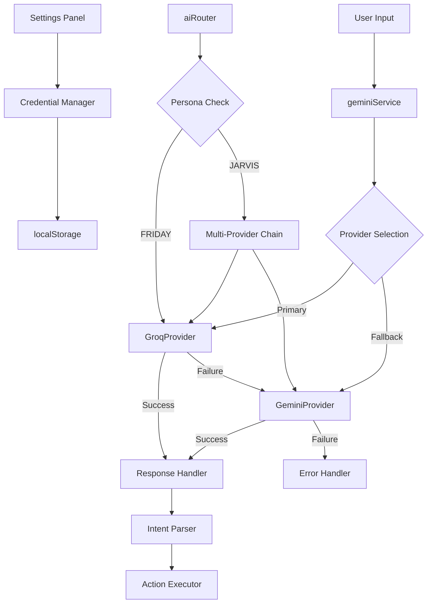

# Design Document: Groq API Integration

## Overview

This design integrates Groq API as the primary AI provider for the Cognitive OS desktop assistant application. Groq will handle all chat and intent generation tasks using the `llama3-70b-8192` model (or latest available). The system implements a multi-AI fallback architecture where Groq serves as the primary provider, with Gemini as a secondary fallback. The integration maintains compatibility with the existing provider architecture while optimizing for Groq's fast response times and efficient token usage.

## Architecture

The integration follows the existing multi-provider architecture pattern, adding Groq as a new provider implementation while modifying the routing logic to prioritize Groq for all operations.



## Main Algorithm/Workflow

```mermaid
sequenceDiagram
    participant User
    participant geminiService
    participant GroqProvider
    participant GeminiProvider
    participant intentService
    participant ActionExecutor
    
    User->>geminiService: ask(input, context)
    geminiService->>geminiService: Check local cache
    alt Cache Hit
        geminiService-->>User: Cached response
    else Cache Miss
        geminiService->>GroqProvider: callGroq(prompt, key)
        alt Groq Success
            GroqProvider-->>geminiService: Response
            geminiService->>geminiService: parseResponse()
            geminiService-->>User: Parsed result
        else Groq Failure
            GroqProvider-->>geminiService: Error
            geminiService->>GeminiProvider: callGemini(prompt, key)
            alt Gemini Success
                GeminiProvider-->>geminiService: Response
                geminiService->>geminiService: parseResponse()
                geminiService-->>User: Parsed result
            else Both Failed
                GeminiProvider-->>geminiService: Error
                geminiService-->>User: Error message
            end
        end
    end
    
    User->>intentService: generatePlan(text)
    intentService->>geminiService: ask(input, context)
    geminiService-->>intentService: Parsed command
    intentService->>intentService: buildPlanFromCommand()
    intentService-->>User: Execution plan
    intentService->>ActionExecutor: Execute plan


## Implementation Details

### Groq Provider Class

```javascript
class GroqProvider {
  constructor(apiKey) {
    this.apiKey = apiKey;
    this.name = 'Groq';
    this.baseUrl = 'https://api.groq.com/openai/v1/chat/completions';
  }

  async sendMessage(messages, options = {}) {
    const signal = options.signal;
    
    try {
      const response = await fetch(this.baseUrl, {
        method: 'POST',
        headers: {
          'Content-Type': 'application/json',
          'Authorization': `Bearer ${this.apiKey}`,
        },
        body: JSON.stringify({
          model: 'llama3-70b-8192',
          messages,
        }),
        signal,
      });

      if (!response.ok) {
        throw new Error(`Groq Error: ${response.status}`);
      }

      const data = await response.json();
      return {
        text: data.choices[0].message.content,
        status: 'SUCCESS',
        provider: this.name,
      };
    } catch (error) {
      if (error.name === 'AbortError') throw error;
      return {
        text: error.message,
        status: 'ERROR',
        provider: this.name,
      };
    }
  }
}
```

### Provider Registration

The Groq provider must be added to the `providers` object in `aiProviders.js`:

```javascript
export const providers = {
  OpenAI: OpenAIProvider,
  Gemini: GeminiProvider,
  Claude: ClaudeProvider,
  Groq: GroqProvider,  // New provider
};
```

### Service Modification

The `geminiService.js` must be updated to support Groq as a provider option:

1. Add `callGroq` method similar to `callGemini`
2. Update `getProviderConfig` to include `groqKey`
3. Modify `ask` method to route to Groq when provider is "groq"
4. Implement fallback logic: Groq → Gemini

### Settings Panel Updates

Add Groq API key input field to the settings panel:

```javascript
<input
  type="password"
  placeholder="Groq API Key"
  value={groqKey}
  onChange={(e) => setGroqKey(e.target.value)}
/>
```

Add Groq to provider selection dropdown:

```javascript
<select value={provider} onChange={(e) => setProvider(e.target.value)}>
  <option value="gemini">Gemini</option>
  <option value="groq">Groq</option>
  <option value="openai">OpenAI</option>
  <option value="claude">Claude</option>
</select>
```

## Correctness Properties

*A property is a characteristic or behavior that should hold true across all valid executions of a system—essentially, a formal statement about what the system should do. Properties serve as the bridge between human-readable specifications and machine-verifiable correctness guarantees.*

### Property 1: Provider Response Format Consistency

*For any* provider response (success or error), the returned object SHALL contain text, status, and provider fields, where status is either "SUCCESS" or "ERROR"

**Validates: Requirements 1.4, 1.5**

### Property 2: Fallback Chain Activation

*For any* Groq provider error response, the gemini_Service SHALL invoke Gemini_Provider as the fallback provider

**Validates: Requirements 2.2, 7.5**

### Property 3: No Fallback on Success

*For any* successful Groq provider response, the gemini_Service SHALL NOT invoke Gemini_Provider and SHALL return the parsed response

**Validates: Requirements 2.4, 2.5**

### Property 4: Credential Storage Round-Trip

*For any* API keys object containing provider credentials, saving the keys then loading them SHALL produce an equivalent object, with the stored value being base64 encoded in localStorage

**Validates: Requirements 3.1, 3.2, 3.3**

### Property 5: Multi-Provider Key Persistence

*For any* combination of provider keys (Groq, Gemini, OpenAI, Claude), storing and retrieving the keys SHALL preserve all provider credentials without loss

**Validates: Requirements 3.5**

### Property 6: API Key Format Validation

*For any* input string, the Settings_Panel validation SHALL correctly identify whether it matches the valid Groq API key format

**Validates: Requirements 4.2**

### Property 7: JSON Command Detection

*For any* text containing a valid JSON object with action and target fields, the Response_Parser SHALL return a command object with kind "command"

**Validates: Requirements 6.1, 6.2**

### Property 8: Non-JSON Chat Fallback

*For any* text that does not contain a valid JSON object with action and target fields, the Response_Parser SHALL return a chat object with kind "chat"

**Validates: Requirements 6.3**

### Property 9: Code Fence Stripping

*For any* valid JSON object wrapped in markdown code fences (```json or ```), the Response_Parser SHALL correctly parse the JSON after removing the fences

**Validates: Requirements 6.4**

### Property 10: Cache Hit Behavior

*For any* input string, when the same input is requested twice consecutively, the second request SHALL return the cached response without making a new API call

**Validates: Requirements 8.4**

### Property 11: Command to Plan Conversion

*For any* valid command object with a recognized action type, the intent_Service SHALL generate a non-empty execution plan

**Validates: Requirements 9.2**

### Property 12: History Size Limit with Eviction

*For any* sequence of interactions, the conversation history SHALL never exceed 10 entries, and when the 11th entry is added, the oldest entry SHALL be removed

**Validates: Requirements 10.1, 10.3**

### Property 13: History Recording

*For any* successful interaction, the gemini_Service SHALL add both the user input and assistant response to the conversation history

**Validates: Requirements 10.2**

## Testing Strategy

### Unit Tests

Unit tests should focus on:
- Provider class instantiation and configuration
- Error handling for specific HTTP status codes (401, 403, 429, 503, 5xx)
- Response parsing for various text formats
- Credential encoding/decoding edge cases
- Settings panel UI interactions

### Property-Based Tests

Property-based tests should verify:
- Response format consistency across all providers
- Fallback chain behavior under various failure scenarios
- Credential round-trip preservation
- JSON detection and parsing across diverse inputs
- Cache behavior with various input patterns
- History management with different interaction sequences

Each property test must:
- Run a minimum of 100 iterations
- Reference the design document property number
- Use tag format: **Feature: groq-api-integration, Property {number}: {property_text}**

### Integration Tests

Integration tests should verify:
- End-to-end request flow from user input to action execution
- Actual API communication with Groq and Gemini services
- Settings panel persistence to localStorage
- Provider switching and fallback in real scenarios

## Security Considerations

1. **API Key Storage**: Keys are base64 encoded in localStorage, which provides obfuscation but not encryption. Consider using more secure storage mechanisms for production.

2. **Key Validation**: Validate API key format before making requests to prevent unnecessary API calls with invalid credentials.

3. **Error Messages**: Avoid exposing sensitive information in error messages returned to users.

4. **Rate Limiting**: Implement client-side rate limiting to prevent abuse and respect API quotas.

## Performance Considerations

1. **Response Time**: Groq is optimized for fast inference, typically responding in <1 second for most queries.

2. **Caching**: Local response caching reduces redundant API calls for repeated queries.

3. **Throttling**: 2-second minimum delay between requests prevents rate limit issues while maintaining responsiveness.

4. **Fallback Overhead**: Fallback to Gemini adds latency only when Groq fails, not during normal operation.

## Migration Path

1. **Phase 1**: Add Groq provider class to `aiProviders.js`
2. **Phase 2**: Update `geminiService.js` to support Groq routing
3. **Phase 3**: Add Groq configuration to Settings Panel
4. **Phase 4**: Update credential manager to handle Groq keys
5. **Phase 5**: Test fallback chain with both providers
6. **Phase 6**: Deploy and monitor Groq usage metrics

## Success Metrics

- **Response Time**: Average response time < 1 second for Groq requests
- **Fallback Rate**: Groq → Gemini fallback occurs < 5% of the time
- **Error Rate**: Overall error rate (both providers failing) < 1%
- **User Adoption**: > 80% of users configure Groq as primary provider within 30 days
